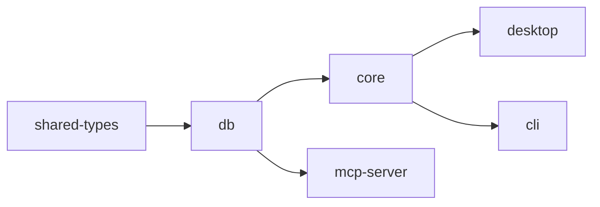

<div align="center">

# FreeCrawl SEO Tool

### Open-source desktop SEO crawler — a free, cross-platform alternative to Screaming Frog

[](LICENSE)
[](https://github.com/kemalai/FreeCrawl-SEO-Tool/releases)
[](https://github.com/kemalai/FreeCrawl-SEO-Tool/stargazers)
[](https://github.com/kemalai/FreeCrawl-SEO-Tool/commits/main)
[](#-quick-start)

**[🌐 Website](https://freecrawl.net/)** ·
**[📦 Download](https://github.com/kemalai/FreeCrawl-SEO-Tool/releases)** ·
**[🐛 Report Bug](https://github.com/kemalai/FreeCrawl-SEO-Tool/issues)** ·
**[📝 Changelog](CHANGELOG.md)**

<br />

A high-performance website crawler built for serious SEO audits. Targets <kbd>1M+ URLs</kbd> on a single machine, with a dense Screaming Frog–style UI, **150+ SEO issue checks**, and zero native dependencies.

</div>

<br />

---

## ✨ What FreeCrawl Does

FreeCrawl is a desktop SEO crawler that scales to **1M+ URLs on a single machine** at 80–150 URL/s via undici with keep-alive, with optional **JavaScript rendering** through headless Chromium (Playwright) that captures the post-JS DOM, full-page / above-fold / mobile screenshots, LCP candidate elements, and a per-URL mobile usability audit. It runs **150+ on-page SEO checks across 30 top-level tabs** — exact and near-duplicate clustering (SimHash + LSH) with a dedicated Cluster view, full hreflang validation (reciprocity, self-reference, inconsistent lang), OpenGraph / Twitter Card / JSON-LD / Web App Manifest parsing, AMP smoke validation, structured-data validation (duplicate `@id`, malformed `@type`, missing required props), WCAG accessibility checks (`<main>` landmark, skip-link, ARIA roles, heading order), security headers + SSL/TLS chain audit + active/passive mixed content split, readability scores (Flesch, Flesch–Kincaid, Gunning Fog), and a 10-rule custom CSS + regex extraction engine with a **live Preview dialog and JSON import / export** for sharing rule sets.

The **dense dark UI** renders virtualized 1M-row tables that live-stream rows during a crawl, with **List ↔ Tree ↔ Cluster view toggles**, **column pin (sticky-left) + drag-to-reorder + show/hide**, advanced AND/OR filters across 24 fields × 12 operators, per-tab quick-filter dropdowns, a 16-tab Details panel per URL (URL Details, Outline, Inlinks, Outlinks, Images, Resources, Extracted Data, SERP Snippet, HTTP Headers, Cookies, Structured Data, View Source, View Rendered, Screenshot, Duplicates, Analytics), an English + Turkish UI including every Settings panel, **in-app scheduled crawls** (hourly / daily / weekly / custom), a live memory monitor, robots.txt syntax validator, URL rewriting with live preview, project-vs-project compare diff, a Cytoscape link graph in its own native window, and a `.seoproject` file association for OS double-click.

Integrations cover **Google Search Console** (clicks, impressions, CTR, position + URL Inspection coverage), **Google Analytics 4** (sessions, users, bounce, engagement), **PageSpeed Insights** Lighthouse audits, custom **AI prompts via OpenAI / Anthropic Claude / local Ollama** with `{url}`/`{title}`/`{description}`/`{h1}`/`{body}` variables, and **SEO authority providers** (Ahrefs / Majestic / Moz / Semrush) behind a single dropdown — each integration card now ships with an **in-app step-by-step Setup Guide modal** in English and Turkish that walks you through OAuth client creation, test-user setup, API enablement, and the most common errors. Exports go through a unified **Export Crawl Data dialog** (Excel `.xlsx` / CSV UTF-8 / JSON / XML with hierarchical category selection and nested folder output) plus a standalone HTML audit report, sitemap generator (standard / image / hreflang / sharded / gzipped), and direct streaming to **Google Sheets** and **BigQuery**. Project files can be saved as **password-protected encrypted snapshots** (`.seoproject.enc`, AES-256-GCM + PBKDF2). The **MCP server** exposes **76 tools** that let Claude Code or any MCP client drive crawls live, query every UI surface, trigger exports, fetch GSC/GA4 data on demand, and modify settings — every action a human user can take in the desktop is callable from an agent. Crawl-completion webhooks, OS notifications, 22 built-in reports (histograms, top/bottom URLs, link positions, top words, cross-source orphans), per-URL **Duplicates** view, and a custom-CSS theme override round out the suite. Everything runs **fully local** — no telemetry, no cloud, MIT-style license.

<br />

---

## 🛠 Tech Stack

<div align="center">


</div>

| Layer | Choice |
| :--- | :--- |
| 🟢 **Runtime** | Node.js 22 LTS+ (ESM-first) |
| 📘 **Language** | TypeScript 5.7+ strict |
| 🪟 **Desktop shell** | Electron 41 |
| ⚡ **Build** | electron-vite 5 / Vite 7 |
| 🎨 **UI** | React 19 + Tailwind 3.4 + Zustand 5 |
| 📊 **Tables** | `@tanstack/react-table` + `@tanstack/react-virtual` |
| 🌐 **HTTP** | undici 8 |
| 🔎 **HTML parse** | cheerio (htmlparser2 fast path) |
| 📥 **Queue** | p-queue 8 |
| 🤖 **robots** | robots-parser 3 |
| 💾 **Storage** | `node:sqlite` + WAL — **zero native deps** |
| 📦 **Distribution** | electron-builder 26 |

<br />

---

## 🚀 Quick Start

> [!TIP]
> **End users**: download the prebuilt installer from the [Releases page](https://github.com/kemalai/FreeCrawl-SEO-Tool/releases) — no setup required.

<details>
<summary><b>🪟 Windows</b> — easiest path is the <code>.bat</code> launcher</summary>

<br />

Double-click **`FreeCrawl-SEO-Tool-Start.bat`** at the repo root. It verifies Node.js, runs `npm install` on first launch, then starts the app with `npm run dev`.

> **Don't want to install?** Grab the **portable `.exe`** from the [Releases page](https://github.com/kemalai/FreeCrawl-SEO-Tool/releases) — runs without installation.

Or manually:

```bat
git clone https://github.com/kemalai/FreeCrawl-SEO-Tool.git
cd FreeCrawl-SEO-Tool
npm install
npm run dev
```

</details>

<details>
<summary><b>🍎 macOS</b> — Apple Silicon + Intel</summary>

<br />

Easiest path is the **`FreeCrawl-SEO-Tool-Start.sh`** launcher at the repo root — same one-click flow as the Windows `.bat` (verifies Node, prompts to install on first run, then starts the app).

```bash
chmod +x FreeCrawl-SEO-Tool-Start.sh
./FreeCrawl-SEO-Tool-Start.sh
```

Or manually:

```bash
# 1. Install prerequisites (skip any you already have)
brew install node@22 git
xcode-select --install      # Command Line Tools — required once

# 2. Clone and run
git clone https://github.com/kemalai/FreeCrawl-SEO-Tool.git
cd FreeCrawl-SEO-Tool
npm install
npm run dev
```

If macOS Gatekeeper blocks an unsigned local build (`"App is damaged"`):

```bash
xattr -cr "/Applications/FreeCrawl SEO.app"
```

</details>

<details>
<summary><b>🐧 Linux</b> — Debian / Ubuntu / Fedora / Arch</summary>

<br />

Easiest path is the **`FreeCrawl-SEO-Tool-Start.sh`** launcher at the repo root (same as macOS).

Prebuilt installers are available for all three families: **`.AppImage`** (universal), **`.deb`** (Debian / Ubuntu), and **`.rpm`** (Fedora / RHEL).

```bash
# 1. Install Node.js 22 LTS (Debian / Ubuntu via NodeSource)
curl -fsSL https://deb.nodesource.com/setup_22.x | sudo -E bash -
sudo apt install -y nodejs git

# Fedora / RHEL : sudo dnf install nodejs:22 git
# Arch          : sudo pacman -S nodejs npm git

# 2. Clone and run
git clone https://github.com/kemalai/FreeCrawl-SEO-Tool.git
cd FreeCrawl-SEO-Tool
npm install
npm run dev
```

> Some headless / minimal distros also need GTK/X11 runtime libs for Electron:
> `sudo apt install -y libgtk-3-0 libnss3 libasound2t64`

</details>

<details>
<summary><b>⌨ CLI (headless crawl)</b></summary>

<br />

```bash
npm run build:cli
node apps/cli/dist/index.js https://example.com --depth 2 --max 500 --out out.csv
node apps/cli/dist/index.js --list urls.txt --out out.json     # list mode + JSON
```

**CI / CD recipes** — ready-to-use [GitHub Actions](docs/ci/github-actions-example.yml) and [GitLab CI](docs/ci/gitlab-ci-example.yml) examples that crawl your site on a schedule, fail the build when broken-URL count exceeds a threshold, and upload the crawl as an artifact.

</details>

<details>
<summary><b>📦 Production build (per-platform installers)</b></summary>

<br />

```bash
npm run build                                  # all packages + desktop + CLI
npm --workspace apps/desktop run build:win     # Windows installer (NSIS) + portable .exe
npm --workspace apps/desktop run build:mac     # macOS DMG (arm64 + x64)
npm --workspace apps/desktop run build:linux   # AppImage / .deb / .rpm
```

</details>

<details>
<summary><b>🤖 MCP server</b> — query AND drive crawls from Claude / any MCP client</summary>

<br />

FreeCrawl ships an **MCP (Model Context Protocol) server** that exposes the active `.seoproject` to AI agents over stdio. Two capabilities in one server:

1. **Read-only data access** to the SQLite project — runs alongside the desktop app without contention (WAL allows concurrent readers).
2. **Live crawl control** — when the desktop app is open, an agent can start / pause / resume / stop crawls and poll progress in real time. This goes through a localhost-only HTTP bridge (127.0.0.1, ephemeral random port, 32-byte Bearer token auth, discovery file written to `<userData>/mcp-bridge.json` on app launch).

**47 tools**:

| Group | Tools |
| :--- | :--- |
| 📊 **Top-level data** | `get_summary`, `get_overview_counts`, `top_issues`, `query_urls`, `get_url_detail` |
| 🔬 **Per-URL detail sub-tabs** | `get_url_source` (raw + rendered + screenshot paths), `get_url_inlinks`, `get_url_outlinks`, `get_url_images`, `get_url_headers`, `get_url_duplicates`, `get_url_analytics`, `get_url_cert` |
| 🧩 **Integration rows** | `query_gsc`, `query_ga4`, `query_pagespeed`, `query_ai`, `query_seo` |
| 🔎 **Specialised queries** | `query_images`, `query_broken_links`, `list_duplicate_clusters` |
| 📈 **Reports** | `report_status_code_histogram`, `report_indexability_distribution`, `report_content_kind_distribution`, `report_depth_histogram`, `report_response_time_histogram`, `report_inlinks_histogram`, `report_word_count_histogram`, `report_url_length_histogram`, `report_top_urls_by`, `report_top_anchor_texts`, `report_external_domain_health`, `report_image_weight_per_page`, `report_link_position_breakdown`, `report_pages_per_directory`, `report_word_count_per_directory`, `report_sitemap_orphans`, `report_analytics_coverage`, `report_server_header_breakdown` |
| 📁 **Project management** | `list_projects`, `set_project`, `current_project` |
| 🕷 **Crawl control** (desktop must be open) | `start_crawl`, `stop_crawl`, `pause_crawl`, `resume_crawl`, `clear_crawl`, `get_crawl_progress`, `get_desktop_project` |

`start_crawl` accepts a `startUrl` plus optional whitelisted overrides (scope, maxDepth, maxUrls, maxConcurrency, maxRps, crawlDelayMs, requestTimeoutMs, respectRobotsTxt, followRedirects, crawlExternal, userAgent, include/excludePatterns) — anything you don't override keeps the desktop user's saved value. Crawls launched via MCP go through the **same code path** as the UI's Start button, so progress shows up in the desktop app live as the agent drives it. Call `clear_crawl` first when you want a fresh BFS after a completed crawl with the same seed URL (otherwise the crawler treats the re-start as a resume and exits because every URL is already in the DB).

**1. Build it once:**

```bash
npm run build:mcp
```

This produces `apps/mcp-server/dist/index.js`.

**2. Register it with your MCP client.**

<details>
<summary><b>Claude Desktop</b></summary>

Edit your Claude Desktop config:

| Platform | Path |
| :--- | :--- |
| Windows | `%APPDATA%\Claude\claude_desktop_config.json` |
| macOS | `~/Library/Application Support/Claude/claude_desktop_config.json` |
| Linux | `~/.config/Claude/claude_desktop_config.json` |

```json
{
  "mcpServers": {
    "freecrawl": {
      "command": "node",
      "args": ["/absolute/path/to/FreeCrawl-SEO-Tool/apps/mcp-server/dist/index.js"]
    }
  }
}
```

Restart Claude Desktop. The `freecrawl` server appears under the tool 🔌 icon.

</details>

<details>
<summary><b>Claude Code (CLI)</b></summary>

```bash
claude mcp add freecrawl -- node /absolute/path/to/FreeCrawl-SEO-Tool/apps/mcp-server/dist/index.js
```

</details>

<details>
<summary><b>Other MCP clients</b></summary>

Run the binary directly with stdio transport:

```bash
node apps/mcp-server/dist/index.js
```

The server speaks newline-delimited JSON-RPC 2.0 — point any MCP-compatible client at it.

</details>

**3. Try it.** Ask your agent things like:

> *"Crawl https://example.com with maxDepth 3 and watch the progress."*
> *"Show the 10 URLs with the longest response time in my last crawl."*
> *"What are the top 5 issue categories with the most affected pages?"*
> *"List every URL with a missing meta description."*
> *"Pause the running crawl, then resume it once I've checked the first 1000 URLs."*

**Pointing at a non-default project:**

By default the server reads `<userData>/projects/default.seoproject` (the same file the desktop app uses). Override with the `FREECRAWL_PROJECT` env var, or call the `set_project` tool mid-session:

```json
{
  "mcpServers": {
    "freecrawl": {
      "command": "node",
      "args": ["/path/to/apps/mcp-server/dist/index.js"],
      "env": { "FREECRAWL_PROJECT": "/path/to/audit.seoproject" }
    }
  }
}
```

</details>

<br />

---

## 📋 Prerequisites

<details>
<summary><b>For developers / source builds</b></summary>

<br />

| Component | Minimum | Where |
| :--- | :--- | :--- |
| **Node.js** | 22 LTS (24 also OK) | [nodejs.org](https://nodejs.org/) |
| **npm** | 10+ (ships with Node) | bundled |
| **Git** | any recent | [git-scm.com](https://git-scm.com/) |

> **Why no Python / MSBuild / node-gyp?** FreeCrawl uses Node 22's built-in `node:sqlite` instead of `better-sqlite3`. There are zero native dependencies — `npm install` never invokes a C++ compiler.

Verify your setup:

```bash
node --version    # v22.x.x or v24.x.x
npm --version     # 10+
```

</details>

<details>
<summary><b>Runtime requirements (any platform)</b></summary>

<br />

- **Outbound HTTPS access** to the sites you crawl. Behind a corporate proxy? Set `HTTPS_PROXY=http://your-proxy:port` before launch — undici's `ProxyAgent` routes through it automatically.
- **TLS root certificates**. Node ships with the Mozilla CA bundle. If your antivirus or company proxy performs HTTPS inspection (Kaspersky, ESET, Zscaler, BlueCoat, …), set `NODE_EXTRA_CA_CERTS=C:\path\to\corp-ca-bundle.crt` — otherwise crawls fail with `UNABLE_TO_GET_ISSUER_CERT_LOCALLY`.

</details>

<details>
<summary><b>Disk + memory budget</b></summary>

<br />

| Resource | Size |
| :--- | :--- |
| `node_modules` after `npm install` | ~600 MB |
| Production Electron build | ~150 MB |
| Peak RAM, 100K-URL crawl | ~100 MB |
| 1M-URL crawl | comfortably under 1 GB |

</details>

<br />

---

## 📁 Project Structure

```
FreeCrawl-SEO-Tool/
├── 📄 FreeCrawl-SEO-Tool-Start.bat   # Windows one-click launcher
├── 📄 FreeCrawl-SEO-Tool-Start.sh    # macOS / Linux one-click launcher
├── 📄 CHANGELOG.md                   # versioned release notes
├── 📂 apps/
│   ├── 🪟 desktop/                   # Electron app (main + preload + renderer)
│   ├── ⌨  cli/                       # headless Node CLI
│   └── 🤖 mcp-server/                # MCP server for AI agents
└── 📂 packages/
    ├── 🔗 shared-types/              # IPC + domain types
    ├── 💾 db/                        # ProjectDb (node:sqlite) + migrations
    └── 🕷 core/                      # crawler engine (UI-agnostic)
```

**Dependency graph**



<br />

---

## 📈 Status

> [!NOTE]
> **Active development.** All 29 analysis tabs (Internal, External, Response Codes, URL, Page Titles, Meta Description, H1, H2, Content, Images, Canonicals, Directives, Redirects, Pagination, Hreflang, AMP, Structured Data, Meta Refresh, Custom Extraction, Custom Search, Security, Duplicates, Links, Broken Links, SERP, **PageSpeed, Search Console, GA4, AI, SEO Authority**) plus standalone Visualization window, advanced search, **per-tab quick-filter dropdown** + **List/Tree view toggle**, 150+ issue categories, sitemap export variants, **Export Crawl Data dialog (XLSX / CSV-UTF-8 / JSON / XML with hierarchical tree picker + nested folder output)**, list mode, custom extraction, near-duplicate + exact-duplicate detection, hreflang validation, project compare, Cytoscape visualization, auth, proxy, webhook, **MCP server with crawl control + live progress**, **Google PageSpeed / Search Console / URL Inspection / GA4 integrations**, **AI per-URL prompts (OpenAI / Anthropic / Ollama)**, **SEO Authority providers (Ahrefs / Majestic / Moz / Semrush)**, **Google Sheets + BigQuery direct export**, **encrypted project snapshots (AES-256-GCM)**, **cross-source orphan detection**, **JavaScript rendering with Playwright (post-JS DOM, screenshot capture, LCP candidate, Mobile Usability audit)**, **memory-limit auto-pause watchdog**, OS notifications, **robots.txt syntax validator**, URL rewriting + preview, **status-code diagnosis banner**, **live memory monitor**, **in-app scheduled crawl**, **multi-language UI (EN + TR) with full Settings coverage**, **`.seoproject` file association**, in-app logs, and diagnostic popups are working. Cross-platform installers (Windows `.exe` + portable, macOS `.dmg`, Linux `.AppImage` / `.deb` / `.rpm`) — **release builds ship Playwright Chromium offline so JS rendering works on first launch**. Live-streaming UX with **first row in ~1 s**.
>
> **Upcoming (V2):** Log file analyzer, Plugin system, Light theme, Multi-window, Code-signing + auto-update.

<br />

---

## 🤝 Contributing & Support

<div align="center">

| | |
| :---: | :---: |
| 🐛 **Found a bug?** | [Open an issue](https://github.com/kemalai/FreeCrawl-SEO-Tool/issues) |
| 💡 **Have a feature idea?** | [Start a discussion](https://github.com/kemalai/FreeCrawl-SEO-Tool/issues) |
| 📦 **Want the prebuilt app?** | [Download a release](https://github.com/kemalai/FreeCrawl-SEO-Tool/releases) |
| 🌐 **Project website** | [freecrawl.net](https://freecrawl.net/) |

</div>

<br />

---

<div align="center">

### 📜 License

**MIT** — see [LICENSE](LICENSE)

<sub>Built with ❤ for SEO professionals who want a fast, free, open alternative to Screaming Frog.</sub>

</div>
